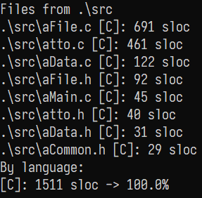

# atto

> A Truly Tiny text editOr

Yet another text editor ought to be as simple/small as possible (following the KISS principle). It is purely written in C and
it's designed to be used solely on Microsoft Windows (relies on Win32 API). MinGW GCC has been used as the compiler.

Currently, my other tool [slocWin32](https://github.com/makuke1234/slocWin32) reports only **1513** lines of code for this editor:

Very small indeed...

If you are intereseted in a more feature-rich analogue of this editor, check out my other
repository [femto](https://github.com/makuke1234/femto).

There also exists a separate deprecated [with_profiler](https://github.com/makuke1234/atto/tree/with_profiler) branch if you are interested in a version with debug logging.

# Obtaining

32-bit (x86) & 64-bit (x64) Windows binaries can be obtained [here](https://github.com/makuke1234/atto/releases).

# Features

Currently a fixed number of features is supported:
- [x] file must be given as a command-line argument, 'raw editing'/'saving later to a file' is impossible for a reason
- [x] all saved files use CRLF line-ending format by default, LF and CR are also supported with version 1.8
- [x] atto editor utilizes the whole command prompt window, window is as big as your console currently is
- [x] the last line of the window is dedicated to status, for example showing success or failure when an attempt to save the file has been made
- [x] the following keyboard shortcuts:
    | Key                            | Action                                   |
    | ------------------------------ | ---------------------------------------- |
    | <kbd>ESC</kbd>                 | Closes the editor                        |
    | <kbd>Ctrl+S</kbd>              | Tries to save the current open file      |
    | <kbd>Ctrl+R</kbd>              | Tries to reload contents of current file |
    | <kbd>Ctrl+E</kbd> <kbd>F</kbd> | Switch to CRLF EOL sequence              |
    | <kbd>Ctrl+E</kbd> <kbd>L</kbd> | Switch to LF EOL sequence                |
    | <kbd>Ctrl+E</kbd> <kbd>C</kbd> | Switch to CR EOL sequence                |
- [x] 2 ways to start the program:
    | Syntax          | Action                                                                                                  |
    | --------------- | ------------------------------------------------------------------------------------------------------- |
    | `atto`          | Shows help                                                           |
    | `atto` \[file\] | Starts editor with the specified file, does not have to exist *where \[file\] is the file's name* |

# Screenshots

## Demonstrating unicode support, file test5.txt is open with LF EOL sequences

## Last key shown on status bar with respective repeat count

## Saving was successful, file size is now 48 bytes

# Changelog

* 2.3
	* Tweak key behaviour, Ctrl+E doesn't have to be immediately released anymore
* 2.2
	* Adopt tweaked status messages from [femto](https://github.com/makuke1234/femto)
* 2.1
	* Make a version with removed profiler code, store the profiler version as a backup
	* Also remove debug asserts from that 'cleaned' version
* 2.0
    * Refactor and optimise codebase
* 1.9
    * Fix bug in renderer with editor randomly freezing when inserting characters
        * *Renderer went into an infinite loop, if free space was 0 in line buffer*
    * Add 64-bit version
* 1.8
    * Add extra documentation
    * Add support for CR and CRLF EOL sequences, LF is still supported
    * Files are saved using CRLF by default
    * Add support for changing EOL sequneces
* 1.7
    * Eliminate global variables
    * Add new data-save check, only saves if any changes were made
    * Fix bug with program crashing on empty files
    * Self-document code in the header files
* 1.6
    * Add minor check in input loop
    * Fix bug with cursor not showing properly on very long lines
    * Enhance viewpoint adaption
    * Add tabs-to-spaces automatic conversion
* 1.5
    * Add extra warnings to compilation, adjust code accordingly
    * Update `restrict`-correctness
    * Remove unnecessary `const`-madness
* 1.4
    * Fix memory leak in Unicode conversion functions, if input string is empty
* 1.3
    * Refactor and modularise codebase
    * Remove profiling from release build, make binary ~2x smaller
* 1.2
    * Rename everything finally from "pico" to "atto". "pico" was chosen initially,
    later swapped it out for "atto" ("pico" is already taken (predecessor of [GNU nano](https://github.com/madnight/nano))).
* 1.1
    * Fix arrow characters in status messages
* 1.0
    * Initial release

# Contributing

This project is by no means perfect. Feel free to report any bugs, that you may find, under
**[Issues](https://github.com/makuke1234/atto/issues)**.
Feature requests are also welcome but keep in mind that the priority of this editor
is to be as small as possible. Bug fixing is my first priority.

# License

As stated, the project uses MIT license.
