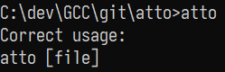

# atto

Yet another text editor ought to be as simple/small as possible (following the KISS principle). It is purely written in C and
it's designed to be used solely on Microsoft Windows (relies on Win32 API). MinGW-32 GCC has been used as the compiler.

# Obtaining

32-bit (x86) Windows binaries can be obtained [here](https://github.com/makuke1234/atto/releases).

# Features

Currently a fixed number of features is supported:
- [x] file must be given as a command-line argument, 'raw editing'/'saving later to a file' is impossible for a reason
- [x] all saved files use LF line-ending format
- [x] pico editor utilizes the whole command prompt window, window is as big as your console currently is
- [x] the last line of the window is dedicated to status, for example showing success or failure when an attempt to save the file has been made
- [x] the following keyboard shortcuts:
	| Key    | Action |
	| ------ | ------ |
	| ESC    | Closes the editor |
	| Ctrl+S | Tries to save the current open file |
	| Ctrl+R | Tries to reload contents of current file |
- [x] 2 ways to start the program:
	| Syntax        | Action |
	| ------------- | ------ |
	| atto          | Shows help  |
	| atto \[file\] | Starts editor with the specified file, file does not have to exist prior (where \[file\] is the file's name) |

# Changelog

* 1.1
	* Fix arrow characters in status messages
* 1.0
	* Initial release

# Contributing

This project is by no means perfect. Feel free to report any bugs that you may find under
**[Issues](https://github.com/makuke1234/atto/issues)**.
Feature requests are also welcome but keep in mind that the priority of this editor
is to be as small as possible. Bug fixing is my first priority.

# License

As stated, the project uses MIT license.
